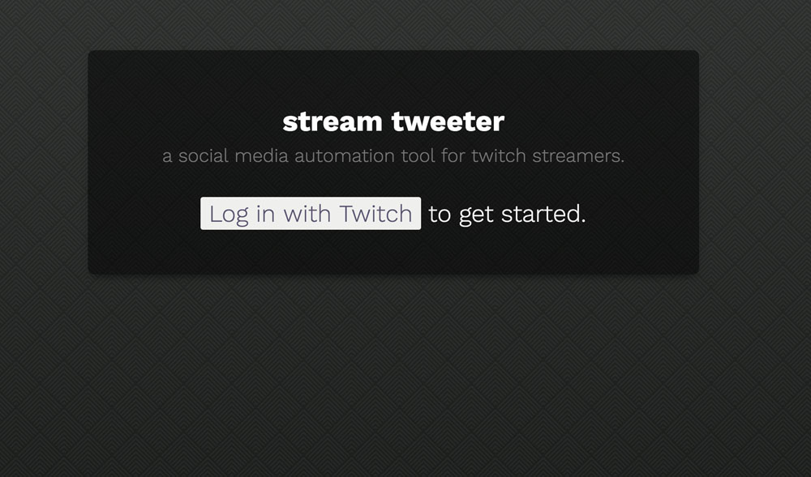
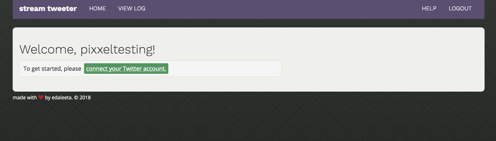
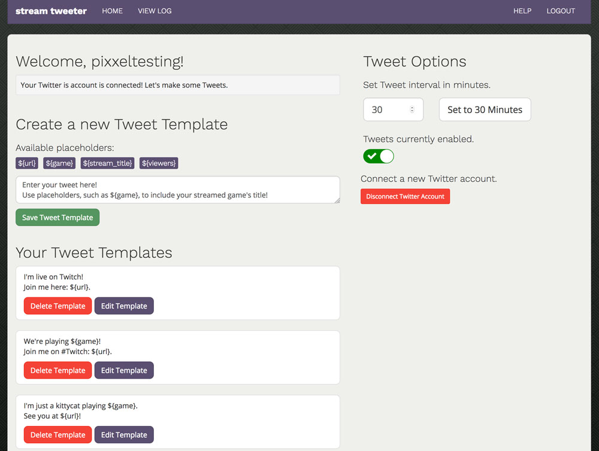
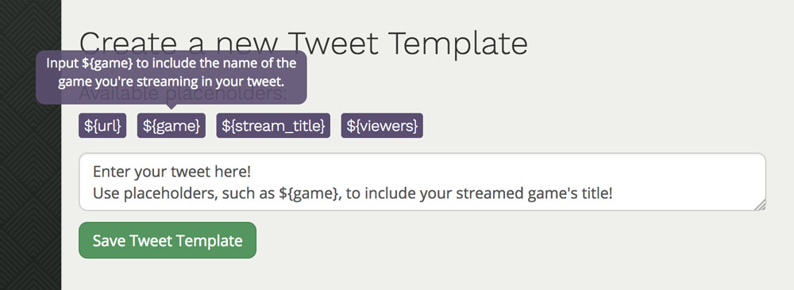
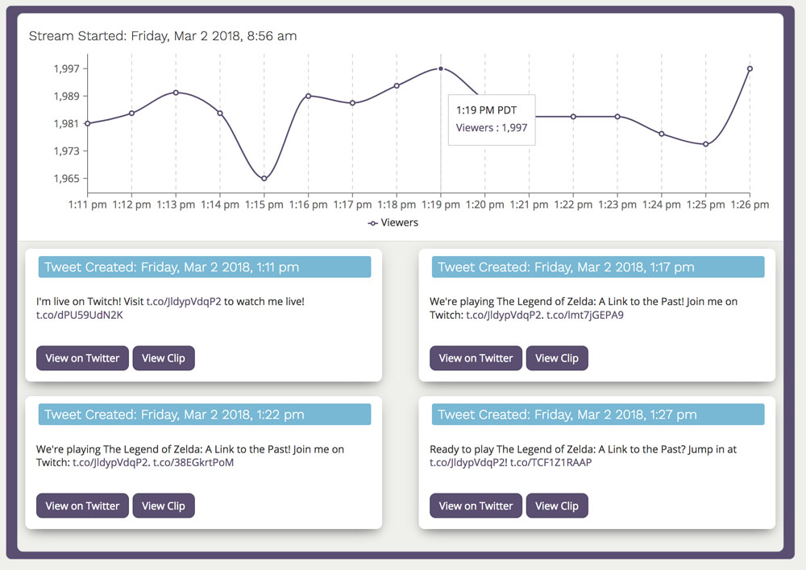
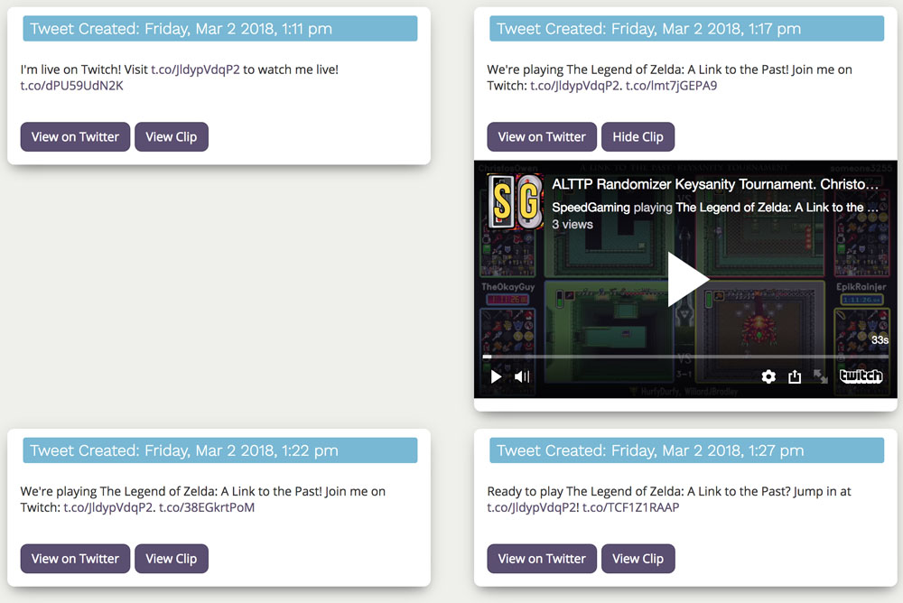

# Stream Tweeter
## Summary
[**Stream Tweeter**](https://streamtweeter.com) is a social media automation tool that uses the Twitch API to publish dynamically generated content and information about a user’s Twitch stream to their own Twitter feed.

A user logs in with their Twitch account and connects their Twitter account. The user then creates tweet templates that can include placeholders for real-time information, such as the currently streaming game. The app subscribes to webhooks for real-time detection of a user's stream status, and on a configurable interval, generates a Twitch Clip from the user’s stream which is then embedded into a tweet.

Additionally, data about the user’s stream is regularly saved to display metrics and a log of created content in the user’s dashboard.

## Deployment
https://streamtweeter.com

## About the Developer
Developed and maintained by Edelita Valdez, a software engineer in San Francisco, CA.
This is her first project.
Learn more about her at [edaleeta.com](http://edaleeta.com/) or [LinkedIn](https://www.linkedin.com/in/edelita/).

## Tech Stack
| Backend           | Frontend     | APIs    | Deployment |
|-------------------|--------------|---------|------------|
| Python            | Javascript   | Twitch  | nginx      |
| Flask             | React        | Twitter | gunicorn   |
| PostgreSQL        | Webpack      |         | AWS        |
| SQLAlchemy        | Less         |         |            |
| flask-apscheduler | Bootstrap    |         |            |
| flask-oauthlib    | Recharts     |         |            |
| requests          | React Router |         |            |
|                   | moment.js    |         |            |
*Additional libraries found in [requirements.txt](requirements.txt) and [package.json](app/package.json)*.

## User Flow
>  The user logs in with Twitch.

> The user is prompted to connect their Twitter account.

> After authorizing Twtter, the user can now see the interface to create/edit Tweet Templates and adjust Tweet settings.

> A user can hover or tap on available placeholders to see hints about how they will filled in when the tweet is published.

> 'View Log' displays a user's Stream Tweeter history which includes the user's viewer metrics, the tweets posted, and the clips created during a live steam session.

*Special thanks to [Create React App](https://github.com/facebook/create-react-app) for creating an easy-to-use starting point for React and [Let's Encrypt](https://letsencrypt.org/) for the free SSL cert.*

